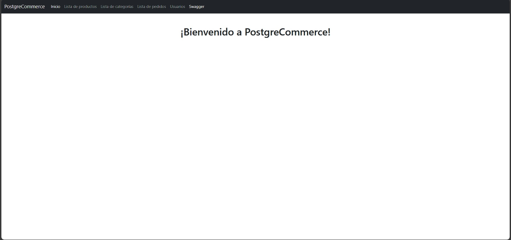

# 🧮 🛒 PostgreCommerce API

Aplicación web que simula la administración básica de una tienda online, desarrollada con Spring Boot y un enfoque centrado en APIs REST, seguridad robusta y una interfaz simple pero funcional.

## 🔧 Funcionalidades Principales

- **Gestión de productos 📦**  - Consulta, creación y actualización de ítems
- **Autenticación y autorización 🔐**  - Spring Security y BCrypt
- **Documentación interactiva 📄**  - Swagger UI para probar endpoints
- **Pruebas de API 📬**  - Testing con Postman

## 📋 Características Técnicas

- **API RESTful 🌐** - Endpoints organizados para integración externa
- **Seguridad avanzada 🔒** - Manejo de usuarios y contraseñas cifradas
- **Estructura modular 📁** - Separación por capas

## 🚀 Tecnologías Utilizadas

### Backend
- **Spring Boot** - Framework para desarrollo de servicios REST
- **Spring Security** - Autenticación, autorización y encriptación
- **BCrypt** - Hash seguro de contraseñas
- **Swagger** - Documentación automática de la API
- **Postman** – Herramienta para pruebas de endpoints
- **Java** – Lenguaje de programación
- **Maven** – Gestión de dependencias

### Frontend
- **HTML5** - Estructura de la página web
- **CSS3** - Estilo visual
- **JavaScript** - Interacción y validaciones básicas

### Base de Datos
- **PostgreSQL** - Sistema de gestión de base de datos relacional
## Autor

- [@AgustinGalan02](https://www.github.com/AgustinGalan02)

## 

## Screenshots

